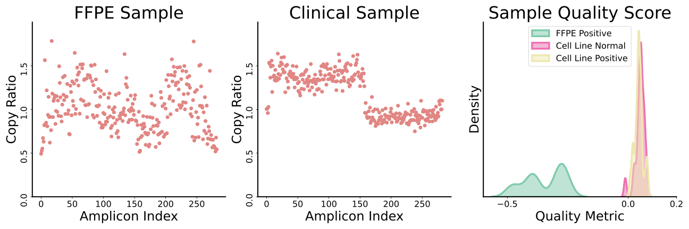

# StateCNV

**A Bayesian State-Space Method for Copy Number Variation Detection and Thalassemia Profiling**

## Summary

This paper introduces a probabilistic framework for accurately classifying copy number variation (CNV) profiles in genetic disorders, with a focus on thalassemia. Using targeted amplicon sequencing data, the method applies a state-space model to account for spatial dependencies between genomic regions and leverages auxiliary particle filtering to detect abrupt CNV transitions. Bayesian decision theory is then used to assign each sample to a predefined CNV profile, and Bayesian evidence is employed to flag low-quality samples. The approach achieves high sensitivity and specificity for thalassemia classification and is broadly applicable to other CNV-driven disorders, including BRCA-related mutations.

## Paper Link

[https://arxiv.org/abs/2504.10338](https://arxiv.org/abs/2504.10338)

## Sample Quality Assessment Figure

